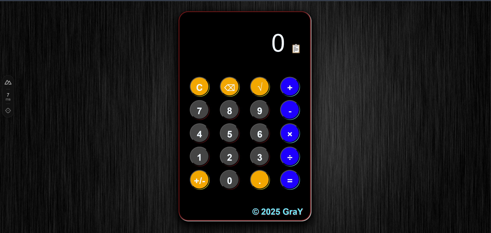

# 3D Calculator (Nuxt 3 + Vue 3)



A modern 3D calculator app built with Nuxt 3 & Vue 3.  
Features animated tilt, responsive design, clipboard copy, and a clean dark UI.

## 🚀 Live Demo

[View Online (Netlify)](https://your-netlify-link)

## 🛠️ Features

- **3D Tilt Animation** — Calculator visually responds to mouse movement.
- **Standard Operations** — Addition, subtraction, multiplication, division, square root, plus/minus, backspace, clear, decimal point.
- **Copy Result** — Copy the result to clipboard with one click (📋).
- **Custom Design** — Dark theme, colored buttons, animated hover effects.
- **Responsive Layout** — Works great on both desktop and mobile.
- **Input Limitations** — Prevents overflow, handles invalid input, and protects against errors.
- **Built with Nuxt 3 + Vue 3** — Uses `<script setup>`, Composition API, and Nuxt SSR for a modern codebase.

## 🖥️ How to Run Locally

```bash
git clone https://github.com/GrayMurakami/3d-calculator-nuxt.git
cd 3d-calculator-nuxt
npm install
npm run dev
npm run dev
Visit http://localhost:3000 in your browser.
```

## 🏗️ Production
Build for production on Netlify:

```bash
npm run build
npm run preview
